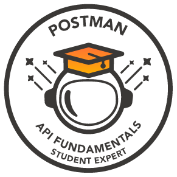

<h1 align="center"><b>Hi 👋, I'm Swarnadeep Paul</b></h1>
<h3 align="center">Passionate about Technology</h3>

- 🔭 I’m currently working on **DSA & Development**

- 🌱 I’m currently learning **Algorithms**

## **🔗 Connect with Me**

  

   
   
   
   
   
   
  

## **🖥️ Tools & Platforms / Languages**

  

  
  
  
  
  
  
  
  
  
  
  

## **🏅 Badges**

  <table>
    <tr>
      <td align="center" width="100">   Postman API Student Expert</td>
    </tr>
  </table>

## **📈 Some Stats**

---
