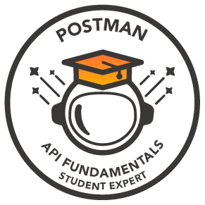
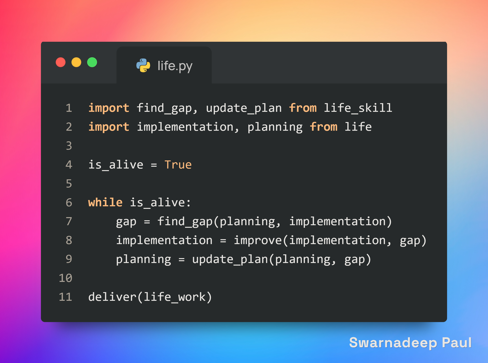
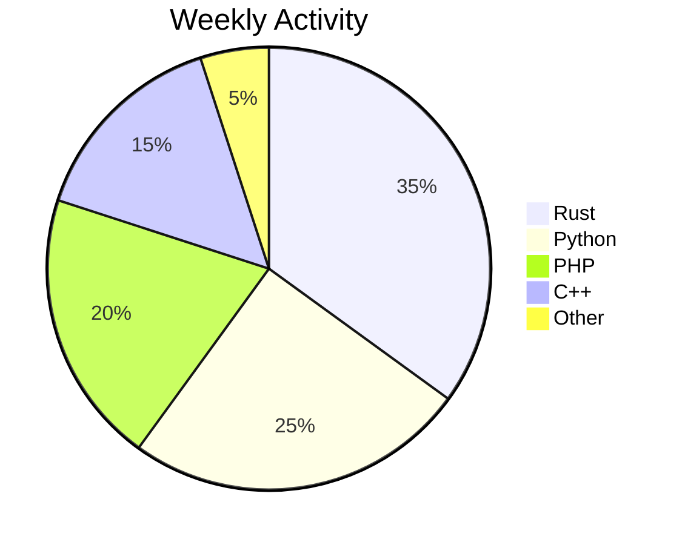

  
<!---->

## 🔗 Connect with Me

| | | | | | |
|:---:|:---:|:---:|:---:|:---:|:---:|
|  |  |  |  |  |  |

---
## **🖥️ Tools & Platforms / Languages**

  
  
  

## **🏅 Badges and Certificates**

  <table>
    <tr>
      <td align="center" width="100">   Postman API Student Expert</td>
      <td align="center" width="100">   CS50 R Certificate</td>
    </tr>
  </table>

 

## **Quotes by Me**

  

  
      

## **📈 Some Stats**

---

<!--

```mermaid
pie
    title Weekly Activity
    "Rust" : 35
    "Python" : 25
    "PHP" : 20
    "C++" : 15
    "Other" : 5
```
-->
